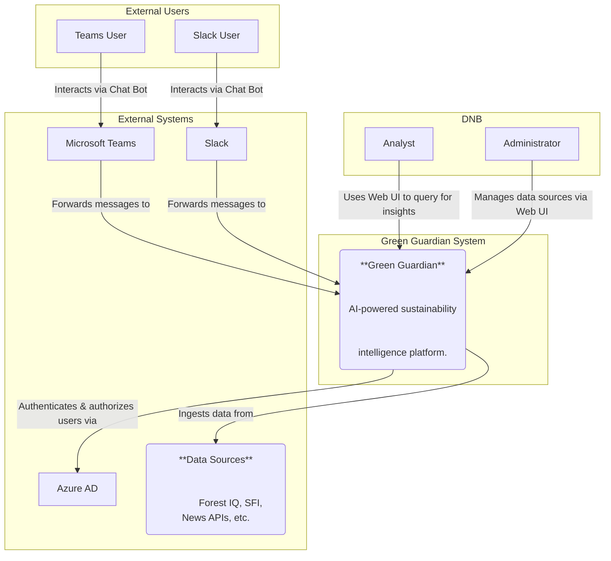
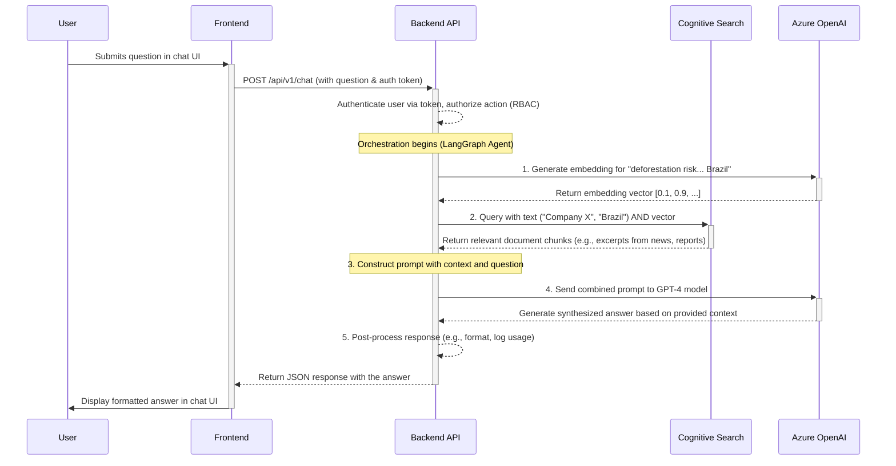
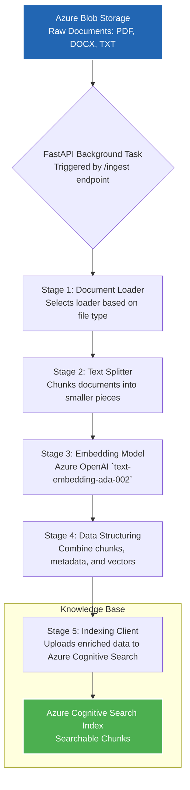
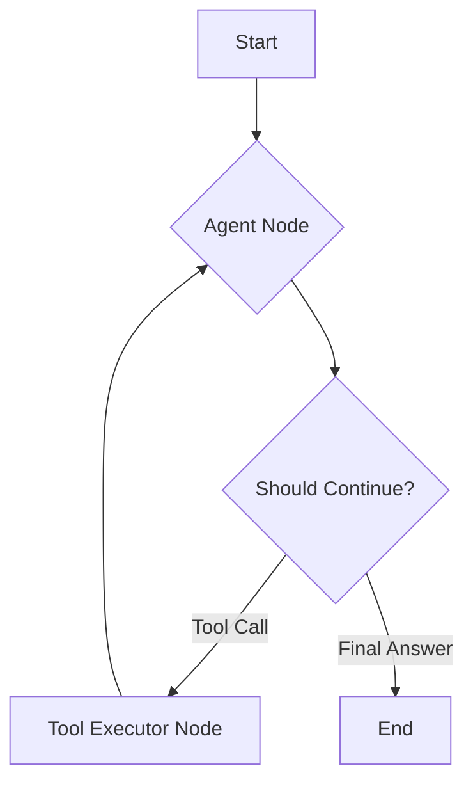
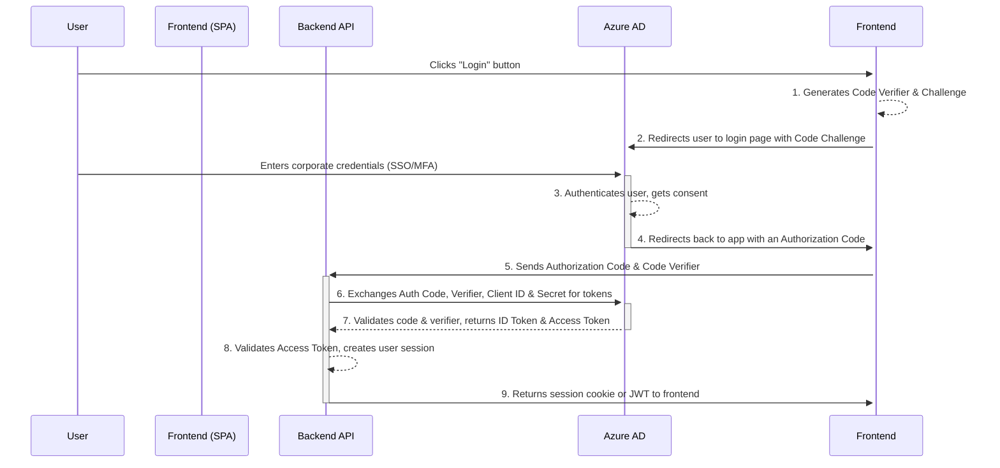

# Green Guardian: Technical Deep Dive & Architectural Reference

---

## Table of Contents

*   **Chapter 1: Project Vision & Technical Objectives**
    *   1.1 The Challenge: The ESG Data Labyrinth in Modern Finance
    *   1.2 The Solution: An AI-Powered Sustainability Intelligence Platform
    *   1.3 Core Technical Principles
    *   1.4 Target Personas & Key Use Cases
*   **Chapter 2: System Architecture Deep Dive**
    *   2.1 Architectural Paradigm: A Pragmatic Monolith
    *   2.2 C4 Model: Visualizing the Architecture
        *   2.2.1 Level 1: System Context
        *   2.2.2 Level 2: Container Diagram
    *   2.3 Technology Stack & Rationale
    *   2.4 Data Flow: Anatomy of a RAG Query
*   **Chapter 3: The Backend API**
    *   3.1 Monolith Code Structure
    *   3.2 API Endpoints (`routers`)
        *   3.2.1 The Core Chat Endpoint
        *   3.2.2 Data Ingestion Endpoint
        *   3.2.3 Authentication Routes
    *   3.3 The Service Layer (`services`)
        *   3.3.1 `ChatService`: The RAG Orchestrator
        *   3.3.2 `SearchClient`: Interfacing with Cognitive Search
        *   3.3.3 `OpenAIClient`: The LLM Gateway
    *   3.4 Core Application (`core`)
        *   3.4.1 Configuration Management
        *   3.4.2 Security & Dependencies
*   **Chapter 4: Data Ingestion & Processing**
    *   4.1 The Foundation of RAG: The Ingestion Pipeline
    *   4.2 Pipeline Architecture
    *   4.3 The Five Stages of Ingestion
        *   4.3.1 Stage 1: Sourcing
        *   4.3.2 Stage 2: Loading
        *   4.3.3 Stage 3: Chunking
        *   4.3.4 Stage 4: Embedding
        *   4.3.5 Stage 5: Indexing
    *   4.4 The `IngestionService` in Practice
*   **Chapter 5: AI Orchestration with LangGraph**
    *   5.1 Beyond Simple RAG: The Need for Agency
    *   5.2 Introduction to LangGraph: State Machines for LLMs
    *   5.3 The Green Guardian Agent State
    *   5.4 The Nodes of Our Graph
        *   5.4.1 The Agent Node
        *   5.4.2 The Tools Node
    *   5.5 The Edges: Conditional Logic
    *   5.6 Visualizing the Agentic Graph
    *   5.7 Compiling and Running the Graph
*   **Chapter 6: Security & Identity**
    *   6.1 The Principle of Zero Trust
    *   6.2 Authentication: Azure Active Directory Integration
        *   6.2.1 The OAuth 2.0 Authorization Code Flow
        *   6.2.2 Frontend Implementation (MSAL.js)
        *   6.2.3 Backend Token Validation
    *   6.3 Authorization: Role-Based Access Control (RBAC)
    *   6.4 Secrets Management with Azure Key Vault
    *   6.5 Application & Data Security
*   **Chapter 7: DevOps, Monitoring & CI/CD**
    *   7.1 Philosophy: Automate Everything
    *   7.2 Infrastructure as Code (IaC) with Bicep
        *   7.2.1 Bicep Modules
        *   7.2.2 Parameterization for Environments
    *   7.3 The CI/CD Pipeline: GitHub Actions
        *   7.3.1 Triggering the Workflow
        *   7.3.2 The Backend Test & Build Job
        *   7.3.3 Security Scanning Job
        *   7.3.4 Infrastructure Validation Job
    *   7.4 Observability & Monitoring
        *   7.4.1 Structured Logging
        *   7.4.2 Performance Monitoring with Application Insights
        *   7.4.3 Custom Telemetry for AI Metrics
*   **Chapter 8: Frontend & Integrations**
    *   8.1 The User Interface: Simplicity and Utility
        *   8.1.1 Technology Stack
        *   8.1.2 API Interaction
    *   8.2 Integrations: Meeting Users Where They Are
        *   8.2.1 Microsoft Teams Bot
        *   8.2.2 Slack App
*   **Chapter 9: Glossary**
*   **Appendix A: KQL Queries for Monitoring**

---

## Chapter 1: Project Vision & Technical Objectives

### 1.1 The Challenge: The ESG Data Labyrinth in Modern Finance

In the financial sector, Environmental, Social, and Governance (ESG) criteria have evolved from a niche interest into a critical component of risk management, portfolio strategy, and regulatory compliance. Financial institutions like DNB are tasked with evaluating their portfolios not just for financial returns, but for sustainability impact and risk.

This presents a significant data challenge:
1.  **Data Proliferation & Fragmentation:** ESG data is vast and unstructured. It resides in thousands of disparate sources: corporate sustainability reports (PDFs), regulatory filings, satellite imagery, real-time news feeds, NGO research, and more.
2.  **Lack of Standardization:** Unlike financial metrics, ESG data lacks a universal standard. A "high deforestation risk" may be defined differently across various data providers, making direct comparisons difficult.
3.  **Timeliness:** The sustainability landscape is dynamic. A risk event, such as an oil spill or a policy change, can occur overnight. Relying on quarterly or annual reports is insufficient for proactive risk management.
4.  **Analytical Complexity:** Deriving actionable intelligence requires connecting seemingly unrelated data points. For example, linking a company's subsidiary to a specific geographic location, and then correlating that location with satellite data showing recent environmental changes, is a complex, multi-step analytical process that is nearly impossible to perform manually at scale.

Traditional manual analysis by human teams is slow, expensive, and non-scalable, creating a significant bottleneck for institutions aiming to integrate ESG principles deeply into their operations.

### 1.2 The Solution: An AI-Powered Sustainability Intelligence Platform

Green Guardian is an AI-native solution designed to address these challenges directly. It functions as a **Sustainability Copilot**, augmenting the capabilities of human analysts, not replacing them. Its core mission is to transform the chaotic world of unstructured ESG data into a coherent, queryable, and actionable intelligence layer.

The platform is built on a sophisticated **Retrieval-Augmented Generation (RAG)** architecture. This allows the system to ground the responses of powerful Large Language Models (LLMs) like GPT-4 in a curated, private repository of factual data. This mitigates the risk of LLM "hallucinations" and ensures that the insights provided are auditable and traceable back to the source documents.

### 1.3 Core Technical Principles

The development of Green Guardian is guided by four key technical principles:
1.  **Cloud-Native:** The entire system is designed to run on a managed cloud platform (Microsoft Azure). This provides scalability, reliability, and security, allowing the development team to focus on business logic rather than infrastructure management. We leverage Platform-as-a-Service (PaaS) offerings wherever possible to reduce operational overhead.
2.  **Secure by Design:** Operating in a financial institution demands the highest level of security. Security is not an afterthought but is woven into the architecture, from enterprise-grade identity management (Azure AD) and secret management (Azure Key Vault) to role-based access control (RBAC) and robust monitoring.
3.  **Extensible & Modular:** The system is designed to be easily extended. The backend is built with a clear separation of concerns, and the use of a centralized AI orchestration layer (LangGraph) allows for the easy addition of new data sources, analytical tools, or LLM-powered "skills" without requiring a full system rewrite.
4.  **Pragmatic & Maintainable:** We favor simplicity and proven technologies. The choice of a well-structured Python monolith over a complex microservices architecture for the initial version reflects a pragmatic approach focused on development velocity and maintainability for a small, co-located team.

### 1.4 Target Personas & Key Use Cases

*   **Portfolio Managers:** Use the system to screen potential investments for ESG risks and opportunities, and to monitor the ongoing sustainability performance of their existing portfolio.
*   **Risk Analysts:** Conduct deep-dive investigations into specific companies or sectors, using the conversational interface to rapidly gather and synthesize information from hundreds of sources.
*   **Compliance Officers:** Use the system to generate reports, audit portfolio alignment with regulations (e.g., EU Taxonomy), and ensure that investment decisions are being made with documented consideration for ESG factors.

---

## Chapter 2: System Architecture Deep Dive

### 2.1 Architectural Paradigm: A Pragmatic Monolith

While microservices are a dominant architectural pattern, Green Guardian intentionally employs a **pragmatic monolithic** architecture for its backend services. Given the scope and the size of the development team, this approach provides significant advantages:
*   **Simplified Development:** A single codebase, single build process, and single deployment artifact reduce cognitive overhead and streamline development.
*   **Reduced Latency:** All internal service-to-service communication happens as simple function calls within the same process, eliminating network latency overhead.
*   **Easier Debugging & Testing:** End-to-end testing and debugging are significantly simpler within a single application.

This is not a "big ball of mud" monolith. The application is logically modularized with a clean separation of concerns, closely following the structure encouraged by FastAPI:
*   `routers/`: Defines the API endpoints.
*   `services/`: Contains the core business logic and orchestrates different components.
*   `core/`: Handles cross-cutting concerns like configuration and security.

This structure ensures that as the application grows, it remains maintainable and could be broken out into microservices in the future if the need arises.

### 2.2 C4 Model: Visualizing the Architecture

To understand the system, we use the C4 model, which allows us to zoom in on the architecture at different levels of detail.

#### 2.2.1 Level 1: System Context

This diagram shows how the Green Guardian system fits into its operating environment.



#### 2.2.2 Level 2: Container Diagram

This diagram zooms into the Green Guardian system, showing its major building blocks or "containers" (not to be confused with Docker containers).

```mermaid
graph TD
    subgraph "User Interfaces"
        webapp[("Web UI<br>[HTML/CSS/JS]")]
    end

    subgraph "Green Guardian System (Azure)"
        api[("Backend API<br>[Python/FastAPI]")]
        
        subgraph "Data & State"
            db[(("PostgreSQL<br>Structured Data"))]
            cache[(("Redis<br>Cache"))]
            storage[("Blob Storage<br>Unstructured Docs")]
        end

        subgraph "AI & Search Services"
            search_service[("Cognitive Search<br>Indexing & Hybrid Search")]
            openai_service[("Azure OpenAI<br>LLM & Embeddings")]
        end
    end

    webapp -- "HTTPS API Calls" --> api
    
    api -- "Reads/writes" --> db
    api -- "Reads/writes" --> cache
    api -- "Reads documents from" --> storage
    
    api -- "Orchestrates" --> search_service
    api -- "Orchestrates" --> openai_service
    
    search_service -- "Indexes data from" --> storage
```

### 2.3 Technology Stack & Rationale

| Component         | Technology                               | Rationale                                                                                                                                                             |
| ----------------- | ---------------------------------------- | --------------------------------------------------------------------------------------------------------------------------------------------------------------------- |
| **Backend**       | Python 3.11, FastAPI, Uvicorn            | High-performance async framework. Pydantic integration provides best-in-class data validation. Python's rich AI/ML ecosystem is essential.                               |
| **AI Orchestration**| LangChain, LangGraph                     | Provides abstractions for building complex, stateful, multi-step applications with LLMs. LangGraph allows for creating robust, agentic, cyclical workflows.             |
| **Database**      | PostgreSQL                               | Robust, reliable, and feature-rich open-source RDBMS for storing structured metadata (users, company info, chat history).                                               |
| **Caching**       | Redis                                    | High-performance in-memory cache to store session data and cache expensive queries, reducing latency and database load.                                                 |
| **Document Storage**| Azure Blob Storage                       | Highly scalable and cost-effective object storage for raw, unstructured data sources like PDFs, DOCX, and other documents that feed the RAG process.                     |
| **Search & Indexing**| Azure Cognitive Search                     | A managed service providing sophisticated hybrid search (keyword + vector + semantic). It handles the complex task of indexing documents and performing similarity searches. |
| **AI Models**     | Azure OpenAI Service (GPT-4, Ada)        | Provides enterprise-grade, secure access to state-of-the-art LLMs for generation (GPT-4) and text embeddings (text-embedding-ada-002) which are crucial for RAG.        |
| **Identity**      | Azure Active Directory                   | Centralized, enterprise-grade identity and access management. Integrates seamlessly with corporate logins for a secure and smooth user experience.                          |
| **Infrastructure**| Azure App Service / Container Apps       | Managed PaaS offerings for hosting the backend application, abstracting away the underlying infrastructure and simplifying deployment and scaling.                             |
| **Monitoring**    | Azure Application Insights               | Provides deep performance monitoring, distributed tracing, and structured logging, offering crucial observability into the application's health and behavior.             |

### 2.4 Data Flow: Anatomy of a RAG Query

To understand how the components work together, let's trace a typical user query through the system.

**Objective:** A user asks, "What is the deforestation risk associated with Company X's operations in Brazil?"



**Step-by-Step Breakdown:**
1.  **Query & Authentication:** The user submits their question. The frontend sends this to the backend API, including an Azure AD authentication token in the header.
2.  **Orchestration & Embedding:** The backend's service layer receives the request. The first step in the RAG pipeline is to convert the user's query into a numerical representation (an embedding vector) using the Azure OpenAI embedding service.
3.  **Hybrid Search:** The backend then queries the Azure Cognitive Search index. This is a crucial step. It's a **hybrid search**, meaning it uses two methods simultaneously:
    *   **Keyword Search:** Finds documents that contain the exact terms like "Company X" and "Brazil."
    *   **Vector Search:** Finds documents whose content is semantically similar to the user's query, using the embedding vector. This can find documents that talk about "jungle clearing" even if they don't use the word "deforestation."
4.  **Prompt Construction:** Cognitive Search returns a ranked list of the most relevant text chunks from the source documents. The backend then constructs a detailed prompt for the generative LLM. This prompt essentially says: "Using ONLY the following information [...insert document chunks...], answer this user's question: [...insert original question...]."
5.  **Generation & Response:** This carefully constructed prompt is sent to the Azure OpenAI GPT-4 model. The model synthesizes an answer based *only* on the provided context, ensuring the response is grounded in facts from the knowledge base. This final, generated answer is then sent back to the user.

---

## Chapter 3: The Backend API

The backend API is the central nervous system of the Green Guardian platform. Built with Python 3.11 and the high-performance FastAPI framework, it serves as the primary interface for all user interactions, orchestrates the complex AI workflows, and manages the application's data and state.

### 3.1 Monolith Code Structure

As outlined in the architecture chapter, we've adopted a pragmatic monolithic approach. The code is organized into a logical, feature-based structure that promotes maintainability and a clear separation of concerns.

A typical view of the `backend/app` directory looks like this:

```
app/
├── __init__.py
├── main.py             # FastAPI app instantiation and middleware
|
├── core/               # Cross-cutting concerns
│   ├── __init__.py
│   ├── config.py       # Application settings and secrets management
│   ├── logging.py      # Structured logging configuration
│   └── security.py     # Authentication dependencies and user handling
|
├── models/             # Pydantic data models
│   ├── __init__.py
│   ├── chat.py         # Models for chat requests and responses
│   └── user.py         # User-related models
|
├── routers/            # API endpoint definitions (the "Controller" layer)
│   ├── __init__.py
│   ├── auth.py         # Authentication endpoints
│   ├── chat.py         # The main chat and query endpoints
│   └── ingest.py       # Data ingestion control endpoints
|
└── services/           # Core business logic and external service clients
    ├── __init__.py
    ├── agents.py       # LangGraph agent definitions
    ├── chat_service.py # Orchestrates the entire RAG pipeline
    ├── openai_client.py # Client for Azure OpenAI services
    └── search_client.py # Client for Azure Cognitive Search
```

This structure allows a developer to easily trace a request from its entry point in a `router`, through the business logic in a `service`, to its interaction with external clients or data models.

### 3.2 API Endpoints (`routers`)

The `routers` directory contains the API's public-facing contract. Each file typically corresponds to a logical group of endpoints. FastAPI's `APIRouter` is used to organize these endpoints before they are included in the main `FastAPI` app instance in `main.py`.

#### 3.2.1 The Core Chat Endpoint

The most critical endpoint is `/api/v1/chat`, which handles all user queries.

*File: `app/routers/chat.py`*
```python
from fastapi import APIRouter, Depends, HTTPException
from app.models.chat import ChatRequest, ChatResponse
from app.services.chat_service import ChatService
from app.core.security import get_current_user
from app.models.user import User

router = APIRouter()

@router.post("/chat", response_model=ChatResponse)
async def handle_chat(
    request: ChatRequest,
    chat_service: ChatService = Depends(),
    current_user: User = Depends(get_current_user),
):
    """
    Handles a user's chat message, orchestrates the RAG pipeline,
    and returns the AI-generated response.
    """
    try:
        result = await chat_service.process_message(
            user_id=current_user.id,
            conversation_id=request.conversation_id,
            message=request.message,
        )
        return ChatResponse(
            conversation_id=result.conversation_id,
            response=result.content,
            sources=result.sources
        )
    except Exception as e:
        # Proper logging would happen here
        raise HTTPException(status_code=500, detail="Internal server error")

```
Key features demonstrated here:
-   **Dependency Injection:** FastAPI's `Depends()` system is used extensively. It automatically creates instances of `ChatService` and resolves the `current_user` by calling the `get_current_user` security dependency. This makes the code highly testable and decoupled.
-   **Pydantic Models:** The endpoint expects a JSON body that conforms to the `ChatRequest` model and guarantees its response will conform to the `ChatResponse` model. FastAPI handles all the data validation, parsing, and serialization automatically.

*File: `app/models/chat.py`*
```python
from pydantic import BaseModel
from typing import List, Optional

class ChatRequest(BaseModel):
    conversation_id: Optional[str] = None
    message: str

class SourceDocument(BaseModel):
    document_id: str
    file_name: str
    page_number: Optional[int] = None
    score: float

class ChatResponse(BaseModel):
    conversation_id: str
    response: str
    sources: List[SourceDocument]
```

#### 3.2.2 Data Ingestion Endpoint

To populate our knowledge base, we need an endpoint to trigger the ingestion of new documents.

*File: `app/routers/ingest.py`*
```python
from fastapi import APIRouter, Depends, BackgroundTasks
from app.services.ingestion_service import IngestionService
from app.core.security import require_admin_user

router = APIRouter()

@router.post("/ingest", status_code=202)
async def ingest_documents(
    background_tasks: BackgroundTasks,
    ingestion_service: IngestionService = Depends(),
    _=Depends(require_admin_user) # Protect the endpoint
):
    """
    Triggers the background process to scan for new documents
    in blob storage, process them, and add them to the search index.
    """
    background_tasks.add_task(ingestion_service.ingest_all_documents)
    return {"message": "Document ingestion process started in the background."}
```
-   **Background Tasks:** Data ingestion can be a long-running process. We use FastAPI's `BackgroundTasks` to immediately return a `202 Accepted` response to the client while the ingestion runs in the background. This prevents client timeouts and provides a better user experience.
-   **Endpoint Security:** The `Depends(require_admin_user)` dependency ensures that only users with an "admin" role can access this sensitive endpoint.

#### 3.2.3 Authentication Routes

While the core authentication logic is handled by Azure AD, the backend needs endpoints to facilitate the OAuth2 flow, such as handling redirects and providing token information. These are typically standard boilerplate routes defined in `app/routers/auth.py`.

### 3.3 The Service Layer (`services`)

This is where the application's core logic resides. Services are responsible for coordinating tasks, applying business rules, and acting as a bridge between the API endpoints and the underlying data and AI infrastructure.

#### 3.3.1 `ChatService`: The RAG Orchestrator

This is the most complex and important service. It encapsulates the entire logic of the RAG pipeline described in the previous chapter.

*File: `app/services/chat_service.py`*
```python
from .search_client import SearchClient
from .openai_client import OpenAIClient
from .agents import create_sustainability_agent # LangGraph agent

class ChatService:
    def __init__(self, search_client: SearchClient = Depends(), openai_client: OpenAIClient = Depends()):
        self.search_client = search_client
        self.openai_client = openai_client
        self.agent_executor = create_sustainability_agent(
            llm=self.openai_client.get_llm(),
            search_tool=self.search_client.as_langchain_tool()
        )

    async def process_message(self, user_id: str, message: str, conversation_id: str):
        # The high-level orchestration logic
        
        # 1. Use the LangGraph agent to decide the next step.
        #    This could be a direct search, a call to another tool, or generating a response.
        agent_response = await self.agent_executor.ainvoke({
            "input": message,
            "chat_history": self._get_chat_history(conversation_id)
        })

        # 2. Process the agent's output, format it, and store the conversation turn.
        final_response = self._format_response(agent_response)
        await self._save_conversation(user_id, conversation_id, message, final_response)
        
        return final_response
```
The `ChatService` relies on helper clients to interact with external Azure services, keeping the code clean and testable.

#### 3.3.2 `SearchClient`: Interfacing with Cognitive Search

This service provides a dedicated interface for all interactions with Azure Cognitive Search.

*File: `app/services/search_client.py`*
```python
from azure.core.credentials import AzureKeyCredential
from azure.search.documents.aio import SearchClient as AzureSearchClient
from app.core.config import settings

class SearchClient:
    def __init__(self):
        self.client = AzureSearchClient(
            endpoint=settings.AZURE_SEARCH_ENDPOINT,
            index_name=settings.AZURE_SEARCH_INDEX_NAME,
            credential=AzureKeyCredential(settings.AZURE_SEARCH_API_KEY)
        )

    async def perform_hybrid_search(self, query_text: str, query_vector: list[float]) -> list:
        # Logic to build and execute a complex hybrid search query
        # using the Azure Search SDK for Python.
        # This includes setting up vector queries, filter logic, etc.
        ...
    
    def as_langchain_tool(self):
        # A method to wrap this client's functionality into a tool
        # that can be used by a LangChain/LangGraph agent.
        ...
```

#### 3.3.3 `OpenAIClient`: The LLM Gateway

Similarly, this client handles all calls to the Azure OpenAI service.

*File: `app/services/openai_client.py`*
```python
from openai import AsyncAzureOpenAI
from app.core.config import settings

class OpenAIClient:
    def __init__(self):
        self.client = AsyncAzureOpenAI(
            api_key=settings.AZURE_OPENAI_API_KEY,
            api_version=settings.AZURE_OPENAI_API_VERSION,
            azure_endpoint=settings.AZURE_OPENAI_ENDPOINT
        )

    async def get_embedding(self, text: str) -> list[float]:
        # Call the embedding model
        ...

    async def get_chat_completion(self, prompt: str, context: str) -> str:
        # Call the generative model (GPT-4)
        ...
        
    def get_llm(self):
        # Return a LangChain-compatible LLM instance for use in agents
        ...
```

### 3.4 Core Application (`core`)

The `core` directory is for modules that are used across the entire application.

#### 3.4.1 Configuration Management

We avoid hardcoding configuration values. All settings are managed via environment variables, which are loaded and validated by Pydantic's `BaseSettings`.

*File: `app/core/config.py`*
```python
from pydantic_settings import BaseSettings

class Settings(BaseSettings):
    # Azure credentials
    AZURE_OPENAI_ENDPOINT: str
    AZURE_OPENAI_API_KEY: str
    AZURE_SEARCH_ENDPOINT: str
    AZURE_SEARCH_API_KEY: str
    
    # Database
    DATABASE_URL: str

    # Security
    SECRET_KEY: str # For JWT tokens
    AZURE_AD_CLIENT_ID: str
    AZURE_AD_TENANT_ID: str

    class Config:
        env_file = ".env"
        env_file_encoding = "utf-8"

settings = Settings()
```
This gives us a single, type-hinted `settings` object that can be imported anywhere in the application. Pydantic will automatically raise an error on startup if any required environment variables are missing.

#### 3.4.2 Security & Dependencies

FastAPI's dependency injection system is perfect for handling authentication and authorization.

*File: `app/core/security.py`*
```python
from fastapi import Depends, HTTPException
from fastapi.security import OAuth2AuthorizationCodeBearer
from jose import jwt, JWTError
from app.core.config import settings

# This defines the security scheme
oauth2_scheme = OAuth2AuthorizationCodeBearer(
    authorizationUrl=f"https://login.microsoftonline.com/{settings.AZURE_AD_TENANT_ID}/oauth2/v2.0/authorize",
    tokenUrl=f"https://login.microsoftonline.com/{settings.AZURE_AD_TENANT_ID}/oauth2/v2.0/token"
)

async def get_current_user(token: str = Depends(oauth2_scheme)):
    # This dependency can be used on any endpoint to get the current user.
    # It will:
    # 1. Expect a valid JWT (from Azure AD) in the Authorization header.
    # 2. Decode and validate the token.
    # 3. Fetch user details from our database or the token itself.
    # 4. Return a User model or raise an HTTPException if anything fails.
    ...

async def require_admin_user(user: User = Depends(get_current_user)):
    # This dependency can be used to protect endpoints.
    # It builds on get_current_user and adds an extra check.
    if user.role != "admin":
        raise HTTPException(status_code=403, detail="Not authorized")
    return user
```
By simply adding `Depends(get_current_user)` to an endpoint's signature, that endpoint is automatically protected and provided with the current user's information. This is a powerful and elegant way to handle security.

---

## Chapter 4: Data Ingestion & Processing

### 4.1 The Foundation of RAG: The Ingestion Pipeline

A Retrieval-Augmented Generation (RAG) system is only as intelligent as the data it can retrieve. The most sophisticated LLM and the most complex agentic workflow are useless if the underlying knowledge base is empty or poorly constructed. The **Data Ingestion and Processing Pipeline** is therefore the foundation upon which the entire Green Guardian platform is built.

The primary goal of this pipeline is to convert a heterogeneous collection of large, unstructured source documents (such as PDFs, Word documents, and text files) into a structured, indexed, and semantically searchable knowledge base. This process is not a simple file transfer; it's a transformation that enriches the raw data, making it digestible for our AI models.

### 4.2 Pipeline Architecture

The ingestion pipeline is designed as an asynchronous, idempotent process. It is triggered manually via a secure API endpoint, which launches a background task within the FastAPI application. This design prevents blocking the API for potentially long-running jobs and allows for easy re-running of the entire process.

The pipeline's architecture can be visualized as a sequential flow of data transformation stages:



### 4.3 The Five Stages of Ingestion

Each stage in the pipeline performs a specific and crucial transformation on the data.

#### 4.3.1 Stage 1: Sourcing

The single source of truth for all raw documents is an **Azure Blob Storage container**. This provides a scalable, secure, and cost-effective central repository. New sustainability reports, data feeds, or other documents are simply uploaded to this container. The ingestion service is configured to scan this container for new or updated files to process.

#### 4.3.2 Stage 2: Loading

The first active step is to load the documents into memory. Since documents come in various formats, a loader strategy is employed. The service inspects the file extension (e.g., `.pdf`, `.docx`) and selects the appropriate loader. We heavily leverage LangChain's extensive library of document loaders for this purpose.

*Conceptual Code Snippet:*
```python
from langchain.document_loaders import PyPDFLoader, UnstructuredWordDocumentLoader

def get_loader(file_path: str, file_name: str):
    if file_name.endswith(".pdf"):
        return PyPDFLoader(file_path)
    elif file_name.endswith(".docx"):
        return UnstructuredWordDocumentLoader(file_path)
    # ... other loaders
    else:
        raise ValueError(f"Unsupported file type for {file_name}")

# Usage:
# loader = get_loader("/tmp/some_report.pdf", "some_report.pdf")
# documents = loader.load() # Returns a list of LangChain Document objects
```
Each loaded `Document` object contains the page content and, crucially, metadata such as the source file name.

#### 4.3.3 Stage 3: Chunking

A 100-page PDF cannot be sent to an LLM in one go due to context window limitations. More importantly, for retrieval, we want to find the most specific and relevant passages, not entire documents. The **chunking** (or text splitting) stage is arguably the most critical for the quality of the RAG system.

The goal is to break down large documents into smaller, semantically coherent chunks. The choice of chunking strategy is a balance:
-   **Too small:** The chunk lacks sufficient context for the LLM to understand its meaning.
-   **Too large:** The chunk contains too much irrelevant information (noise), which can dilute the relevant signal and confuse the LLM.

We employ a `RecursiveCharacterTextSplitter`, a robust strategy that tries to split text based on a hierarchy of separators (e.g., `\n\n`, `\n`, ` `). This helps to keep related paragraphs and sentences together.

*Conceptual Code Snippet:*
```python
from langchain.text_splitter import RecursiveCharacterTextSplitter

text_splitter = RecursiveCharacterTextSplitter(
    chunk_size=1000,  # The target size of each chunk in characters
    chunk_overlap=200, # Number of characters to overlap between chunks
    length_function=len,
)

# documents is the output from the loader
chunks = text_splitter.split_documents(documents)
```
The `chunk_overlap` is a key parameter. It creates a "sliding window" effect, ensuring that a sentence or idea that might be split at the end of one chunk is fully present at the start of the next. This helps preserve semantic context across chunk boundaries.

#### 4.3.4 Stage 4: Embedding

Once we have our text chunks, we need a way to represent their meaning numerically so we can perform similarity searches. This is the **embedding** stage.

Each text chunk is sent to the Azure OpenAI `text-embedding-ada-002` model via our `OpenAIClient`. The model returns a high-dimensional vector (an array of 1536 floating-point numbers) for each chunk. This vector is a mathematical representation of the chunk's semantic meaning. Chunks with similar meanings will have vectors that are "closer" together in the high-dimensional space.

This process is computationally intensive and incurs costs per token, so it's performed in batches to optimize performance and throughput.

#### 4.3.5 Stage 5: Indexing

The final stage is to store our processed data in a way that allows for efficient retrieval. We use Azure Cognitive Search for this. Each document we upload to the search index is not a full PDF, but one of the chunks we created.

The search index has a defined schema. A simplified version looks like this:

| Field Name     | Type                       | Attributes                               | Description                                                                 |
| -------------- | -------------------------- | ---------------------------------------- | --------------------------------------------------------------------------- |
| `id`           | `Edm.String`               | Key, Retrievable                         | A unique identifier for each chunk.                                         |
| `content`      | `Edm.String`               | Searchable, Retrievable                  | The actual text content of the chunk.                                       |
| `source_file`  | `Edm.String`               | Filterable, Sortable, Retrievable        | The name of the original document the chunk came from.                      |
| `page_number`  | `Edm.Int32`                | Filterable, Sortable, Retrievable        | The page number in the original document.                                   |
| `content_vector` | `Collection(Edm.Single)` | Searchable (Vector)                      | The 1536-dimension embedding vector for the chunk's content.                |

The `IngestionService` takes the chunks, their metadata, and their newly generated embedding vectors, structures them according to this schema, and uploads them in batches to the Cognitive Search index. Once indexed, the data is immediately available for the hybrid search queries described in Chapter 2.

### 4.4 The `IngestionService` in Practice

Let's tie this all together with a conceptual representation of the main service class.

*File: `app/services/ingestion_service.py`*
```python
from .search_client import SearchClient
from .openai_client import OpenAIClient
from .storage_client import StorageClient # A client for Azure Blob Storage
from langchain.text_splitter import RecursiveCharacterTextSplitter
# ... other imports

class IngestionService:
    def __init__(self, ...):
        self.storage_client = StorageClient()
        self.search_client = SearchClient()
        self.openai_client = OpenAIClient()
        self.text_splitter = RecursiveCharacterTextSplitter(chunk_size=1000, chunk_overlap=200)

    async def ingest_all_documents(self):
        # 1. Get a list of all document blobs from storage
        document_blobs = await self.storage_client.list_documents()

        for blob in document_blobs:
            # Check if this document needs to be updated, etc. (omitted for brevity)
            
            # 2. Download blob and select loader
            temp_file_path = await self.storage_client.download_document(blob.name)
            loader = self._get_loader(temp_file_path, blob.name)
            documents = await loader.load()

            # 3. Chunk the document
            chunks = self.text_splitter.split_documents(documents)

            # 4. Embed the chunks (in batches)
            chunk_texts = [chunk.page_content for chunk in chunks]
            embeddings = await self.openai_client.get_embeddings_batch(chunk_texts)

            # 5. Structure and index the data
            documents_to_index = []
            for i, chunk in enumerate(chunks):
                document = {
                    "id": f"{blob.name}-chunk-{i}",
                    "content": chunk.page_content,
                    "source_file": blob.name,
                    "page_number": chunk.metadata.get("page"),
                    "content_vector": embeddings[i]
                }
                documents_to_index.append(document)
            
            await self.search_client.upload_documents(documents_to_index)
            
            # Clean up temp file
            ...
```
This service encapsulates the entire pipeline, providing a single, clean interface (`ingest_all_documents`) that can be called from our API router's background task. This structured approach ensures that our RAG system is fed with high-quality, semantically enriched data, ready to power intelligent and accurate responses.

---

## Chapter 5: AI Orchestration with LangGraph

### 5.1 Beyond Simple RAG: The Need for Agency

The data flow described in Chapter 2—*embed, search, augment, generate*—is a powerful pattern, but it represents a simple, linear **chain**. For many straightforward questions, this is sufficient. However, in a complex, enterprise-grade application, this linear approach has several limitations:

1.  **Lack of Tool Use:** A simple RAG chain can only do one thing: search its knowledge base. What if we want to answer questions that require other capabilities, like fetching real-time financial data from another API or performing a complex calculation?
2.  **No Cyclical Reasoning:** The real world is messy. Sometimes the first search doesn't yield the right information. A human analyst would then re-evaluate their approach, perhaps rephrasing their search query or looking in a different place. A linear chain cannot do this; it can only move forward.
3.  **Brittleness:** If the retrieved documents don't contain the answer, a simple RAG chain will often try to answer anyway, leading to irrelevant or "I don't know" responses. A more intelligent system should be able to recognize this and inform the user that the answer isn't in its knowledge base.
4.  **Inability to Decompose Questions:** A user might ask a complex question like, "Compare the water usage policies of Company A and Company B and summarize their exposure to water-stressed regions." A simple RAG chain would try to find a single document containing all this information. A better approach is to decompose the problem: search for Company A's policy, search for Company B's policy, search for data on water-stressed regions, and then synthesize the results.

To overcome these limitations, we need to move from a simple chain to an **agent**. An agent is an AI system that uses an LLM not just to answer questions, but to *reason* about the best course of action. It can use a suite of tools, and it can operate in a cyclical fashion until it determines the problem is solved.

### 5.2 Introduction to LangGraph: State Machines for LLMs

To build our agent, we use **LangGraph**, a library built on top of LangChain. While LangChain is excellent for creating linear sequences (chains), LangGraph is designed specifically for building cyclical, stateful, and controllable graphs.

The core concept of LangGraph is the **state machine**. We define a `State` object that represents the current status of our task. We then define a series of `Nodes`, which are functions or callable objects that modify this state. Finally, we define `Edges`, which are rules that determine which node to move to next based on the current state.

This paradigm is a perfect fit for building LLM agents:
-   **The State:** Can hold the input question, the chat history, and any information gathered by tools so far.
-   **The Nodes:** Can represent the LLM "brain" that decides what to do, and the tools that perform actions.
-   **The Edges:** Can be conditional, allowing the graph to loop. For example, an edge could say: "IF the LLM decided to use a tool, go to the `tool_executor` node. ELSE, go to the `response_generator` node."

### 5.3 The Green Guardian Agent State

The first step is to define the state that will be passed between the nodes in our graph. We use a Pydantic `BaseModel` for this, which provides type safety and clarity.

*File: `app/services/agents.py` (Conceptual)*
```python
from pydantic import BaseModel
from typing import List, TypedDict, Annotated
from langchain_core.messages import BaseMessage

class AgentState(TypedDict):
    # The user's input question
    input: str
    
    # The history of the conversation
    chat_history: List[BaseMessage]
    
    # The output of the agent's decision-making step
    # This will contain either a response or a tool call
    agent_outcome: str | List[dict]
    
    # A list of observations from tool calls
    intermediate_steps: Annotated[list, lambda x, y: x + y]
```
-   `input`: The user's most recent question.
-   `chat_history`: The full conversation history, which is crucial for answering follow-up questions.
-   `agent_outcome`: The decision made by the LLM in the "agent" node. This could be a direct answer or a request to call one or more tools.
-   `intermediate_steps`: A list that accumulates the results of any tool calls. We use a special `Annotated` type to ensure that new tool results are appended to the list, not overwritten.

### 5.4 The Nodes of Our Graph

Our agent's graph is simple but powerful, consisting of two primary nodes.

#### 5.4.1 The Agent Node

This node is the "brain" of our operation. It takes the current state (the user's question and conversation history) and decides what to do next. This node is powered by an LLM (GPT-4) that has been specifically prompted to act as a reasoning agent. The prompt instructs the model to either respond to the user directly or, if necessary, to call one of the available tools.

*Conceptual Code Snippet:*
```python
def agent_node(state: AgentState, llm, tools):
    """
    Decides the next action. Either a tool call or a final response.
    """
    # Using LangChain's agent creation helpers
    # This binds the tools to the LLM in a way that it knows
    # how and when to call them.
    agent_runnable = create_openai_tools_agent(llm, tools, agent_prompt)
    
    # Invoke the agent with the current state
    outcome = agent_runnable.invoke({
        "input": state["input"],
        "chat_history": state["chat_history"],
        "intermediate_steps": state["intermediate_steps"]
    })
    
    return {"agent_outcome": outcome}
```

#### 5.4.2 The Tools Node

If the `agent_node` decides to use a tool, this node is responsible for executing it. It takes the tool call request from the `agent_outcome`, runs the corresponding tool (e.g., our `SearchClient`), and appends the result to the `intermediate_steps` in the state.

*Conceptual Code Snippet:*
```python
from langchain.agents import Tool

# This would be our SearchClient wrapped as a LangChain Tool
search_tool = Tool(
    name="sustainability_search",
    func=search_client.perform_hybrid_search,
    description="Search for sustainability reports and documents."
)

def tool_executor_node(state: AgentState):
    """
    Executes the tool calls decided by the agent.
    """
    tool_calls = state["agent_outcome"].tool_calls
    tool_outputs = []
    
    for call in tool_calls:
        # Find the tool to run (e.g., search_tool)
        # Execute it with the provided arguments
        # Append the output to tool_outputs
        ...
        
    return {"intermediate_steps": tool_outputs}
```

### 5.5 The Edges: Conditional Logic

The real power of the graph comes from the edges that connect the nodes. We don't want a linear path; we want a loop.

*Conceptual Code Snippet:*
```python
from langgraph.graph import StateGraph, END

def should_continue(state: AgentState):
    """
    The conditional logic that creates the reasoning loop.
    """
    if isinstance(state["agent_outcome"], list) and len(state["agent_outcome"].tool_calls) > 0:
        # If the agent decided to call a tool, we should continue.
        return "continue"
    else:
        # If the agent did not call a tool, it must have a final answer.
        # We can now exit the loop.
        return "end"

# Building the graph
workflow = StateGraph(AgentState)
workflow.add_node("agent", agent_node)
workflow.add_node("tools", tool_executor_node)

workflow.set_entry_point("agent")

# The conditional edge
workflow.add_conditional_edges(
    "agent",
    should_continue,
    {
        "continue": "tools",
        "end": END
    }
)

# This edge creates the loop. After the tools run,
# their output is added to the state, and we go back to the agent
# for it to decide what to do with the new information.
workflow.add_edge("tools", "agent")
```

### 5.6 Visualizing the Agentic Graph

This code creates the following execution graph:


**The Flow:**
1.  The user's question enters the **Agent Node**.
2.  The agent decides if it can answer directly or if it needs to use a tool (like the search tool).
3.  The **Conditional Edge (`should_continue`)** checks this decision.
4.  If a tool is needed, the graph moves to the **Tool Executor Node**, which runs the search. The results are added to the state.
5.  The graph then **loops back** to the **Agent Node**. The agent now sees the original question *plus* the new information from the search tool.
6.  This loop continues. The agent might decide the search results are enough and it can now generate a final answer. Or, it might decide the initial search was too broad and issue a *new, more specific* search tool call, continuing the loop.
7.  Once the agent is confident it has enough information, it generates a final answer instead of a tool call. The conditional edge sees this and routes the graph to the **End** state, finishing the process.

### 5.7 Compiling and Running the Graph

The final step is to compile the graph into an executable object.

```python
# The final, runnable agent
agent_executor = workflow.compile()

# To run it:
# response = agent_executor.invoke({
#     "input": "What is Company X's deforestation risk?",
#     "chat_history": []
# })
```
This compiled `agent_executor` is what's used inside our `ChatService`. It encapsulates the entire complex, cyclical reasoning process behind a simple `.invoke()` method. This approach provides a robust, extensible, and observable way to build sophisticated AI systems that go far beyond simple RAG.

---

## Chapter 6: Security & Identity

### 6.1 The Principle of Zero Trust

In a modern, cloud-native application, the traditional security model of a hard, trusted corporate network perimeter is obsolete. Services are distributed, and users can access them from anywhere. Green Guardian is therefore designed with a **Zero Trust** mindset. This means we never assume trust based on network location. Instead, every single request to a protected resource must be explicitly authenticated and authorized.

Our security posture is built on a foundation of three core pillars:
1.  **Strong Identity:** Every user and service principal is authenticated through a centralized, enterprise-grade identity provider (Azure AD).
2.  **Explicit Authorization:** Access to data and functionality is governed by granular, role-based permissions.
3.  **Secure Secrets:** All sensitive credentials, keys, and connection strings are stored in a hardened, managed vault and are only accessed at runtime.

### 6.2 Authentication: Azure Active Directory Integration

We delegate the complex and critical task of user authentication to **Azure Active Directory (Azure AD)**, now known as Microsoft Entra ID. This provides numerous advantages:
-   **Single Sign-On (SSO):** Users can log in with their existing corporate credentials, providing a seamless and familiar experience.
-   **Enterprise-Grade Security:** Leverages Microsoft's robust security infrastructure, including features like Multi-Factor Authentication (MFA), conditional access policies, and identity protection.
-   **Centralized Management:** User identities and access policies are managed in a central location by IT administrators.

#### 6.2.1 The OAuth 2.0 Authorization Code Flow

The interaction between our frontend, backend, and Azure AD follows the **OAuth 2.0 Authorization Code Flow with PKCE (Proof Key for Code Exchange)**. This is the industry standard for securing single-page applications (SPAs) and native apps.

Here is a simplified diagram of the flow:



**Key Steps:**
1.  **PKCE Generation:** Before anything else, the frontend generates a secret `code_verifier` and a transformed, public version called the `code_challenge`.
2.  **Login Redirect:** The frontend redirects the user to the standard Microsoft login page, passing along the `code_challenge`.
3.  **User Authentication:** The user authenticates directly with Azure AD. Our application never sees their password.
4.  **Authorization Code:** Azure AD redirects the user back to our application with a temporary, one-time-use `authorization_code`.
5.  **Code Exchange:** The frontend sends this `authorization_code` and the original secret `code_verifier` to our backend API.
6.  **Token Request:** The backend, which holds a trusted `client_id` and `client_secret`, makes a secure, server-to-server call to Azure AD, exchanging the code and verifier for actual tokens.
7.  **Token Issuance:** Azure AD validates that the `code_challenge` from step 2 matches the `code_verifier` from step 6 (this prevents authorization code interception attacks) and issues an `access_token` and an `id_token`.
8.  **Session Creation:** The backend validates the cryptographic signature of the `access_token`, extracts user claims (like user ID and roles), and establishes a session.
9.  **Authenticated State:** The backend signals to the frontend that the user is authenticated, and subsequent API calls from the frontend will include the `access_token` to prove their identity.

#### 6.2.2 Frontend Implementation (MSAL.js)

Implementing this flow from scratch is complex. We use the **Microsoft Authentication Library for JavaScript (MSAL.js)**, which handles the heavy lifting on the client side. It manages the generation of PKCE codes, the redirects to Azure AD, and the secure storage and refreshing of tokens.

#### 6.2.3 Backend Token Validation

On the backend, every request to a protected endpoint must present a valid `access_token` in the `Authorization` header. Our FastAPI application uses a security dependency to validate this token on every request.

*File: `app/core/security.py`*
```python
from fastapi import Depends, HTTPException
from fastapi.security import OAuth2AuthorizationCodeBearer
from jose import jwt, JWTError
from app.core.config import settings

# This defines the security scheme
oauth2_scheme = OAuth2AuthorizationCodeBearer(
    authorizationUrl=f"https://login.microsoftonline.com/{settings.AZURE_AD_TENANT_ID}/oauth2/v2.0/authorize",
    tokenUrl=f"https://login.microsoftonline.com/{settings.AZURE_AD_TENANT_ID}/oauth2/v2.0/token"
)

# In a real implementation, you'd fetch the public signing keys from Azure AD's OIDC endpoint
# and cache them, rather than hardcoding.
AZURE_AD_PUBLIC_KEYS = fetch_keys_from_well_known_endpoint()

async def get_current_user(token: str = Depends(oauth2_scheme)):
    credentials_exception = HTTPException(
        status_code=401,
        detail="Could not validate credentials",
        headers={"WWW-Authenticate": "Bearer"},
    )
    try:
        payload = jwt.decode(
            token,
            AZURE_AD_PUBLIC_KEYS,
            algorithms=["RS256"],
            audience=settings.AZURE_AD_CLIENT_ID,
            issuer=f"https://login.microsoftonline.com/{settings.AZURE_AD_TENANT_ID}/v2.0"
        )
        username: str = payload.get("preferred_username")
        if username is None:
            raise credentials_exception
        # Here, you would typically look up the user in your own database
        # to get their application-specific roles and permissions.
        user = get_user_from_db(username)
        if user is None:
            raise credentials_exception
        return user
    except JWTError:
        raise credentials_exception
```
This dependency ensures that no unauthenticated request can ever reach our core application logic.

### 6.3 Authorization: Role-Based Access Control (RBAC)

Once a user is authenticated, we need to determine what they are authorized to do. We implement a simple but effective Role-Based Access Control (RBAC) system.

Roles are defined within our application's database (e.g., `admin`, `analyst`). These roles can be assigned to users by an administrator. The user's role is then used to protect specific API endpoints.

We achieve this by creating another security dependency that builds on `get_current_user`.

*File: `app/core/security.py`*
```python
# ... (imports and get_current_user)

def require_role(required_role: str):
    """A factory for creating role-based security dependencies."""
    
    async def role_checker(current_user: User = Depends(get_current_user)):
        if required_role not in current_user.roles:
            raise HTTPException(status_code=403, detail="Operation not permitted")
        return current_user
        
    return role_checker

# Example usage on an endpoint:
# @router.post("/ingest", dependencies=[Depends(require_role("admin"))])
# async def ingest_data():
#     ...
```
This `require_role` factory allows us to create dependencies for any role, making our endpoint protection declarative and easy to read. An endpoint that requires admin privileges can be secured with a single line: `dependencies=[Depends(require_role("admin"))]`.

### 6.4 Secrets Management with Azure Key Vault

No secrets—API keys, database connection strings, client secrets—are ever stored in our codebase or in configuration files. Doing so is a major security risk.

We use **Azure Key Vault** as our centralized, secure secrets store.
-   **Hardware Security Modules (HSMs):** Secrets are protected by FIPS 140-2 validated hardware security modules.
-   **Granular Access Policies:** We can define exactly which service principals (i.e., our deployed application) can access which secrets. Developers do not have access to production secrets.

To enable the application to use these secrets, we use **Managed Identity**. When we deploy our FastAPI application to Azure App Service, we enable a system-assigned managed identity. This creates a service principal for our application in Azure AD. We then grant this identity `GET` and `LIST` permissions on the secrets in our Key Vault.

At runtime, our application's `config.py` is modified to use the Azure Identity client library.

*File: `app/core/config.py` (with Key Vault integration)*
```python
from pydantic_settings import BaseSettings
from azure.keyvault.secrets import SecretClient
from azure.identity import DefaultAzureCredential
import os

class Settings(BaseSettings):
    # Non-secret config
    APP_NAME: str = "Green Guardian"
    
    # Secrets that will be populated from Key Vault
    AZURE_OPENAI_API_KEY: str
    DATABASE_URL: str
    
    class Config:
        # Load from .env for local development
        if os.getenv("AZURE_KEY_VAULT_ENDPOINT"):
             # This block is conceptual; libraries exist to make this cleaner
            credential = DefaultAzureCredential()
            client = SecretClient(vault_url=os.getenv("AZURE_KEY_VAULT_ENDPOINT"), credential=credential)
            
            # Override fields from Key Vault
            AZURE_OPENAI_API_KEY = client.get_secret("AzureOpenAIApiKey").value
            DATABASE_URL = client.get_secret("DatabaseURL").value
        else:
            env_file = ".env"

settings = Settings()
```
The `DefaultAzureCredential` is a powerful tool. In a deployed Azure environment, it automatically authenticates using the application's Managed Identity. For local development, it can fall back to using the developer's logged-in Azure CLI credentials, allowing for a seamless experience between local and cloud environments.

### 6.5 Application & Data Security

Beyond identity and secrets, we follow several other security best practices:
-   **Input Validation:** FastAPI's use of Pydantic for all request models means that all incoming data is rigorously validated against a defined schema before it ever hits our application logic. This is a primary defense against a wide range of injection-style attacks.
-   **Prompt Injection Defenses:** We treat all user input as untrusted. Prompts are constructed using structured methods (like LangChain's `PromptTemplate`) that clearly separate instructions from user input. We also implement moderation checks to filter out malicious or off-topic prompts before they are sent to the LLM.
-   **Data Encryption:** All data is encrypted in transit using TLS 1.2+ for all API calls. Data at rest in Azure Storage and Azure PostgreSQL is encrypted by default using Microsoft-managed keys.

---

## Chapter 7: DevOps, Monitoring & CI/CD

### 7.1 Philosophy: Automate Everything

A robust and reliable application is not just well-coded; it is also well-operated. Our DevOps philosophy for Green Guardian is centered on automation to ensure consistency, reliability, and speed. Every aspect of the application's lifecycle, from provisioning infrastructure to testing, scanning, and preparing for deployment, is defined in code and executed within an automated pipeline.

This approach provides several key benefits:
-   **Consistency:** Automated processes eliminate "it works on my machine" problems. The testing and build environment is identical for every single commit.
-   **Speed:** Automation frees up developers from manual, error-prone deployment tasks, allowing them to focus on building features.
-   **Reliability:** Every code change is subjected to a rigorous gauntlet of automated checks, catching bugs, style issues, and security vulnerabilities before they can reach production.
-   **Auditability:** Our infrastructure and deployment pipeline are defined in version-controlled files (`.bicep`, `.yml`), providing a clear, auditable history of every change made to the system.

### 7.2 Infrastructure as Code (IaC) with Bicep

All Azure resources required by Green Guardian are defined using **Bicep**, a domain-specific language (DSL) for declaratively deploying Azure resources. We do not create resources manually through the Azure Portal.

Using IaC provides:
-   **Repeatability:** We can tear down and recreate our entire infrastructure in any environment with a single command.
-   **Versioning:** Infrastructure changes are committed to Git, reviewed in pull requests, and can be rolled back just like application code.
-   **Clarity:** The Bicep files serve as the single source of truth for our cloud architecture.

#### 7.2.1 Bicep Modules

Our Bicep code is organized into modular files. A top-level `main.bicep` file orchestrates the deployment of several smaller, reusable modules.

*Directory Structure: `infra/`*
```
infra/
├── main.bicep              # Main deployment template
├── parameters/
│   ├── dev.json            # Parameters for the development environment
│   └── prod.json           # Parameters for the production environment
└── modules/
    ├── app-service.bicep   # Defines the App Service Plan and App Service
    ├── cognitive-search.bicep # Defines the Cognitive Search instance
    ├── key-vault.bicep       # Defines the Key Vault and access policies
    └── storage.bicep         # Defines the storage account and blob container
```

*File: `infra/main.bicep` (Simplified)*
```bicep
param location string = resourceGroup().location
param environmentName string

// Deploy the storage account using a module
module storage 'modules/storage.bicep' = {
  name: 'storageDeploy'
  params: {
    location: location
    storageAccountName: 'stgreenguardian${environmentName}'
  }
}

// Deploy the Key Vault
module keyVault 'modules/key-vault.bicep' = {
  // ...
}

// Deploy the App Service
module appService 'modules/app-service.bicep' = {
  name: 'appServiceDeploy'
  params: {
    // Pass outputs from other modules as inputs
    keyVaultName: keyVault.outputs.name
    storageConnectionString: storage.outputs.connectionString
  }
}
```
This modular approach makes the infrastructure definition easy to read and manage. We can compose complex environments from smaller, well-defined building blocks.

#### 7.2.2 Parameterization for Environments

To manage differences between environments (e.g., `dev`, `prod`), we use parameter files. The Bicep templates define *what* resources to create, while the JSON parameter files define the specific configuration for each environment, such as SKU sizes, resource names, and specific settings.

*File: `infra/parameters/dev.json`*
```json
{
  "$schema": "https://schema.management.azure.com/schemas/2019-04-01/deploymentParameters.json#",
  "contentVersion": "1.0.0.0",
  "parameters": {
    "environmentName": {
      "value": "dev"
    },
    "appServicePlanSku": {
      "value": "B1" // Basic tier for dev
    }
  }
}
```

### 7.3 The CI/CD Pipeline: GitHub Actions

Our continuous integration and continuous deployment (CI/CD) pipeline is implemented as a **GitHub Actions workflow**. The complete definition is stored in `.github/workflows/ci.yml`. This workflow is the gatekeeper for our codebase.

#### 7.3.1 Triggering the Workflow

The workflow is automatically triggered on every `push` to the `main` or `develop` branches, and on any `pull_request` targeting the `main` branch. This ensures that every proposed change is validated.

#### 7.3.2 The Backend Test & Build Job

This is the main job for validating the application code. It runs in a containerized environment that mirrors our production setup, including service dependencies like PostgreSQL and Redis.

*Key Stages of the `backend-test` job:*
1.  **Environment Setup:** The job checks out the code and sets up a specific Python version (`3.11`). It then starts Docker containers for `postgres:15` and `redis:7` to act as service dependencies for the tests. Health checks ensure the tests don't start until these services are ready.
2.  **Dependency Installation:** It installs all required application and development dependencies from `requirements.txt` and `requirements-dev.txt`, using a cache to speed up subsequent runs.
3.  **Linting & Formatting:** A series of static analysis checks are run to enforce code quality and consistency:
    -   `flake8`: Checks for Python errors and style violations.
    -   `black --check`: Ensures all code adheres to the Black formatting standard.
    -   `isort --check-only`: Verifies that imports are correctly sorted.
    -   `mypy`: Performs static type checking to catch type-related bugs.
4.  **Unit & Integration Tests:** The `pytest` command is executed. This runs all automated tests in the `tests/` directory. The tests run against the live PostgreSQL and Redis containers started earlier, using a dedicated test database. Code coverage is also calculated (`--cov=app`).
5.  **Coverage Upload:** The generated `coverage.xml` report is uploaded to Codecov, a third-party service that tracks coverage over time and reports on it in pull requests.
6.  **Docker Build:** Finally, the job builds a Docker image of the application, tagging it with the Git commit SHA. This confirms that our `Dockerfile` is valid and the application can be successfully containerized.

#### 7.3.3 Security Scanning Job

This job runs in parallel with the main test job and focuses on security vulnerabilities. It uses industry-standard open-source scanning tools.

1.  **Trivy Scan:** Uses `aquasecurity/trivy-action` to perform a filesystem scan of the repository. It looks for vulnerable packages in our dependencies (`requirements.txt`), known vulnerabilities in our base Docker image, and misconfigurations. The results are output as a SARIF file.
2.  **SARIF Upload:** The `trivy-results.sarif` file is uploaded to the GitHub Security tab using the `github/codeql-action/upload-sarif` action. This integration allows developers to see and manage identified vulnerabilities directly within the GitHub UI.
3.  **Snyk Scan:** (If configured) Uses the `snyk/actions/python` action to perform another dependency scan, providing a second layer of defense and leveraging Snyk's extensive vulnerability database.

#### 7.3.4 Infrastructure Validation Job

This job ensures that our Infrastructure as Code is valid and can be deployed.
1.  **Azure Login:** The job securely logs into Azure using a service principal stored as a GitHub secret (`AZURE_CREDENTIALS`).
2.  **Bicep Build & Validate:** It runs two Azure CLI commands:
    -   `az bicep build`: This transpiles our Bicep files into standard ARM templates, verifying the syntax is correct.
    -   `az deployment group validate`: This is a crucial "dry run" command. It simulates a deployment of our Bicep templates against a real Azure resource group. It checks that the templates are valid, the parameters are correct, and that the deployment is possible without actually creating or modifying any resources.

If all of these jobs pass, we have a very high degree of confidence that the code is high-quality, secure, and that both the application and its underlying infrastructure are deployable.

### 7.4 Observability & Monitoring

Once deployed, we need visibility into the application's behavior. This is **observability**. Our primary tool for this is **Azure Application Insights**.

#### 7.4.1 Structured Logging

We configure our application's logger to output logs in a structured JSON format. These logs are automatically collected by the Application Insights agent.

*File: `app/core/logging.py` (Conceptual)*
```python
import logging
import sys
from opencensus.ext.azure.log_exporter import AzureLogHandler
from app.core.config import settings

def setup_logging():
    # Configure logger to send logs to Application Insights
    handler = AzureLogHandler(
        connection_string=settings.APPINSIGHTS_CONNECTION_STRING
    )
    # Add custom dimensions to every log message
    handler.add_telemetry_processor(add_custom_dimensions)
    
    logging.basicConfig(level=logging.INFO, handlers=[handler, logging.StreamHandler(sys.stdout)])

def add_custom_dimensions(envelope):
    # This function is called for every log.
    # We can enrich the log with useful context here.
    envelope.data.baseData.properties["application"] = "GreenGuardian"
    return True
```
This allows us to not only view logs, but to run powerful queries against them using the Kusto Query Language (KQL).

#### 7.4.2 Performance Monitoring with Application Insights

By integrating the Application Insights SDK with FastAPI, we get a wealth of performance data out of the box:
-   **Request Tracing:** We can see the full lifecycle of a request, from the moment it hits our API to the time a response is sent.
-   **Dependency Tracking:** Application Insights automatically instruments calls to external dependencies like our PostgreSQL database and Azure OpenAI. We can see how many calls are made and how long they take, which is invaluable for identifying performance bottlenecks.
-   **Live Metrics:** A real-time dashboard showing request rate, CPU usage, and memory.
-   **Failure Analysis:** Automatically groups exceptions and failed requests, allowing us to quickly diagnose and fix errors.

#### 7.4.3 Custom Telemetry for AI Metrics

Default performance metrics are not enough for an AI application. We need to track AI-specific metrics. We do this by sending **custom events** to Application Insights from our `ChatService`.

*File: `app/services/chat_service.py` (with custom telemetry)*
```python
# ... (imports)
from opencensus.ext.azure.trace_exporter import AzureExporter
from opencensus.trace.samplers import ProbabilitySampler
from opencensus.trace.tracer import Tracer

# In a real app, this tracer would be managed centrally
tracer = Tracer(exporter=AzureExporter(connection_string=...), sampler=ProbabilitySampler(1.0))

class ChatService:
    # ...
    async def process_message(self, ...):
        with tracer.span(name="ProcessChatMessage") as span:
            # ... (RAG logic)
            
            # After getting a response from the LLM
            self.track_openai_event(
                user_id=user_id,
                tokens_used=response_metadata['tokens'],
                model_name=response_metadata['model']
            )
            return final_response

    def track_openai_event(self, user_id, tokens_used, model_name):
        # This sends a custom event to Application Insights
        properties = {
            "user_id": user_id,
            "tokens_used": str(tokens_used),
            "model_name": model_name
        }
        # Code to send a "openai_response_generated" custom event
        # using the OpenCensus SDK or a direct logger call.
```
This custom telemetry allows us to build dashboards and alerts based on critical AI metrics, such as:
-   Token consumption per user or per day.
-   Cost analysis by model.
-   Average latency of LLM responses.
-   Frequency of tool use by the LangGraph agent.

This deep, AI-centric observability is essential for managing the cost, performance, and reliability of the platform.

---

## Chapter 8: Frontend & Integrations

While the backend contains the complex AI and data processing logic, the value of that logic is only realized through effective user interfaces. Green Guardian employs a multi-faceted approach to its user-facing components, prioritizing simplicity and accessibility by integrating into the user's existing workflows.

### 8.1 The User Interface: Simplicity and Utility

The primary user interface is a web-based chat application. In a deliberate move away from the complexity of a modern JavaScript framework-based Single Page Application (SPA), we opted for a simpler, more traditional approach.

The frontend is composed of static HTML, CSS, and vanilla JavaScript files. These files are not hosted on a separate web server or storage account but are served directly from the FastAPI backend itself.

*File: `app/main.py` (Static file mounting)*
```python
from fastapi.staticfiles import StaticFiles

# ... (FastAPI app setup)

# Mount the 'static' directory, which contains CSS, JS, etc.
app.mount("/static", StaticFiles(directory="static"), name="static")

# In a separate router, we would define an endpoint to serve the main HTML page
# @router.get("/", response_class=HTMLResponse)
# async def read_root(request: Request):
#     return templates.TemplateResponse("index.html", {"request": request})
```

This approach provides several key advantages for this project:
-   **Simplified Deployment:** There is only one artifact to deploy—the backend service. This drastically simplifies the CI/CD pipeline and reduces operational complexity.
-   **Zero Configuration:** There is no need to manage CORS (Cross-Origin Resource Sharing) policies, as the UI and the API are served from the same origin.
-   **Low Overhead:** The client-side footprint is minimal, resulting in fast load times and reducing the maintenance burden associated with complex frontend toolchains.

#### 8.1.1 Technology Stack

-   **HTML5:** For structuring the content of the chat interface.
-   **CSS3:** For styling and layout, providing a clean and responsive user experience.
-   **Vanilla JavaScript:** For all client-side logic, including handling user input, making API calls, and rendering chat messages. The native `fetch` API is used for communication with the backend.

#### 8.1.2 API Interaction

The JavaScript application communicates with the backend via the `/api/v1/chat` endpoint detailed in Chapter 3.
1.  **Authentication:** The client-side logic integrates with MSAL.js to handle the Azure AD login flow. On successful login, MSAL acquires an `access_token`.
2.  **API Calls:** Every call to the chat endpoint is an authenticated `POST` request. The JavaScript code attaches the acquired `access_token` as a Bearer token in the `Authorization` header of the request.
3.  **Rendering:** The client receives a JSON response from the API (the `ChatResponse` model) and is responsible for dynamically rendering the AI's message and any source document citations into the HTML DOM.

### 8.2 Integrations: Meeting Users Where They Are

The most effective tools are those that seamlessly integrate into a user's existing environment. To this end, Green Guardian exposes its functionality through bots on two major enterprise collaboration platforms: Microsoft Teams and Slack.

The architectural pattern for both integrations is the same:
1.  A **Bot/App** is registered on the respective platform (Teams or Slack).
2.  The platform provides a secure **webhook URL** or messaging endpoint. This endpoint points to a dedicated API route on our FastAPI backend.
3.  When a user interacts with the bot, the platform sends a payload of data (the message, user info, etc.) to our backend endpoint.
4.  Our backend parses the platform-specific payload, extracts the user's message and identity, and then passes this information to the core `ChatService`.
5.  The `ChatService` processes the message using the same LangGraph agent as the web UI.
6.  The response is formatted into the platform-specific message format (e.g., Teams Adaptive Cards or Slack Block Kit) and sent back to the platform's API to be posted in the chat.

This "adapter" pattern is highly efficient, as it reuses 100% of the core AI and business logic. The integration endpoints are simply thin wrappers that translate between the external platform's data format and our internal service layer.

#### 8.2.1 Microsoft Teams Bot

-   **Framework:** The integration is built using the Microsoft Bot Framework SDK for Python.
-   **Endpoint:** A dedicated API router, e.g., `/api/v1/messaging/teams`, is created on the FastAPI backend to handle incoming POST requests from the Bot Framework Connector service.
-   **Authentication:** User identity is verified based on the trusted payload sent from the Bot Framework service. The user's Teams object ID can be mapped to their corporate identity.
-   **Rich Responses:** The bot can respond with more than just text. We can construct Adaptive Cards to display data, charts, and source documents in a rich, interactive format directly within the Teams client.

#### 8.2.2 Slack App

-   **Framework:** The integration uses the `slack-bolt` Python library, which simplifies the process of handling Slack events and commands.
-   **Endpoint:** A dedicated endpoint, e.g., `/api/v1/messaging/slack`, handles events from Slack. The `slack-bolt` library manages the parsing of these events.
-   **Interaction:** Users can interact with the bot via slash commands (e.g., `/green-guardian query...`) or by directly mentioning the bot in a channel.
-   **Rich Responses:** Slack's Block Kit is used to format responses with buttons, images, and structured layouts, providing a richer user experience than plain text.

By providing these integrations, Green Guardian lowers the barrier to entry for accessing sustainability insights, making it a readily available assistant within the user's natural workspace.

---

## Chapter 9: Glossary

A quick reference for the key technical terms used in this document.

-   **Agent:** An AI system that uses an LLM to reason, decompose problems, and decide when to use tools to accomplish a task.
-   **Azure AD (Entra ID):** Microsoft's enterprise-grade cloud identity and access management service.
-   **Bicep:** A domain-specific language (DSL) for deploying Azure resources declaratively (Infrastructure as Code).
-   **Chunking:** The process of breaking down large documents into smaller, semantically coherent pieces of text for embedding and retrieval.
-   **CI/CD:** Continuous Integration and Continuous Deployment. The practice of automating the build, test, and deployment pipeline.
-   **Cognitive Search:** An Azure managed service that provides sophisticated document indexing and hybrid search capabilities (keyword, vector, semantic).
-   **Embedding:** A numerical representation (a vector) of a piece of text, capturing its semantic meaning.
-   **FastAPI:** A modern, high-performance Python web framework used to build the backend API.
-   **GitHub Actions:** An automation platform integrated with GitHub used to build, test, and deploy the application.
-   **Hybrid Search:** A search technique that combines traditional keyword-based search with modern vector-based semantic search to improve relevance.
-   **IaC (Infrastructure as Code):** The practice of managing and provisioning infrastructure through code and automation rather than manual processes.
-   **LangGraph:** A library for building stateful, multi-actor applications with LLMs, often used to create robust, cyclical agents.
-   **LLM (Large Language Model):** A deep learning model trained on vast amounts of text data, capable of understanding and generating human-like text (e.g., GPT-4).
-   **MSAL.js:** Microsoft Authentication Library for JavaScript. A library that simplifies implementing authentication against Azure AD in single-page applications.
-   **OAuth 2.0:** An industry-standard authorization framework that enables applications to obtain limited access to user accounts.
-   **PaaS (Platform-as-a-Service):** A category of cloud computing services that provides a platform allowing customers to develop, run, and manage applications without the complexity of building and maintaining the infrastructure.
-   **Pydantic:** A Python library for data validation and settings management based on Python type hints.
-   **RAG (Retrieval-Augmented Generation):** An AI architecture that combines a retrieval system (like a search engine) with a generative model (an LLM) to provide answers grounded in a specific knowledge base.
-   **Vector Search:** A search method that finds items based on the semantic similarity of their embedding vectors, rather than exact keyword matches.
-   **Zero Trust:** A security model based on the principle of maintaining strict access controls and not trusting any entity by default, even those already inside the network perimeter.

---

## Appendix A: KQL Queries for Monitoring

Here are some practical Kusto Query Language (KQL) queries that can be used directly in Azure Application Insights to monitor the health and usage of the Green Guardian application, based on the custom telemetry defined in Chapter 7.

### Token Usage & Cost Analysis

```kusto
// Daily token consumption by user and model
customEvents
| where name == "openai_response_generated"
| extend user_id = tostring(customDimensions["user_id"])
| extend model_name = tostring(customDimensions["model_name"])
| extend tokens_used = toint(customDimensions["tokens_used"])
| summarize TotalTokens = sum(tokens_used) by user_id, model_name, bin(timestamp, 1d)
| order by timestamp desc
```

```kusto
// Estimated daily cost by model
// Note: Costs are illustrative and should be updated with current pricing.
customEvents
| where name == "openai_response_generated"
| extend model_name = tostring(customDimensions["model_name"])
| extend tokens_used = toint(customDimensions["tokens_used"])
| extend estimated_cost = case(
    model_name contains "gpt-4", (tokens_used / 1000.0) * 0.03, // Example GPT-4 price
    model_name contains "ada", (tokens_used / 1000.0) * 0.0001, // Example Ada embedding price
    0.0
)
| summarize EstimatedCost = sum(estimated_cost) by model_name, bin(timestamp, 1d)
| render timechart
```

### Performance & Error Analysis

```kusto
// P95 and Average response time for the main chat endpoint
requests
| where name == "POST /api/v1/chat"
| summarize avg(duration), percentile(duration, 95) by bin(timestamp, 1h)
| render timechart
```

```kusto
// Top 5 most common exceptions in the last 24 hours
exceptions
| where timestamp > ago(24h)
| summarize count() by problemId, type, outerMessage
| top 5 by count_
| project type, outerMessage, count_
```

### AI Agent Behavior Analysis

```kusto
// If you add a custom event for tool calls
// Frequency of different tools being used by the agent
customEvents
| where name == "agent_tool_called"
| extend tool_name = tostring(customDimensions["tool_name"])
| summarize count() by tool_name
| render piechart
```
